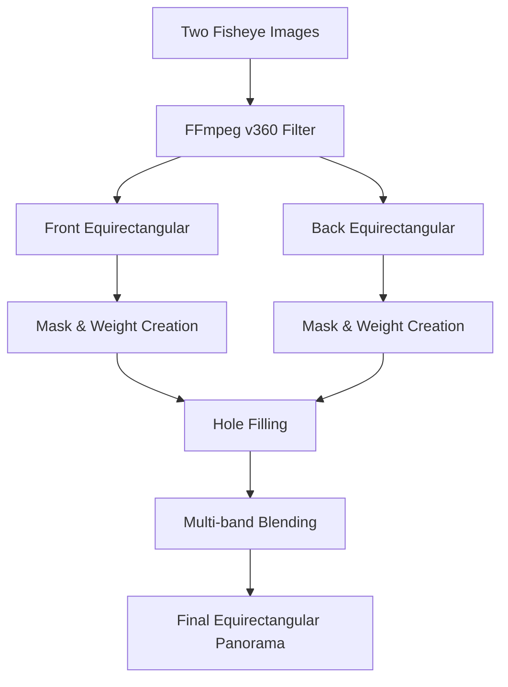

# Dual Fisheye to Equirectangular Stitching - Technical Approach

## Overview

This document explains the technical implementation of dual fisheye image stitching into equirectangular panoramas, mimicking the high-quality output of the Insta360 SDK. The implementation addresses common artifacts (ghosting/vignetting and black holes) through precise parameter tuning and advanced blending techniques.

## Table of Contents

- [Understanding Dual Fisheye Cameras](#understanding-dual-fisheye-cameras)
- [Key Parameters Explained](#key-parameters-explained)
- [Implementation Architecture](#implementation-architecture)
- [Stitching Pipeline](#stitching-pipeline)
- [Parameter Reference](#parameter-reference)
- [Usage Examples](#usage-examples)

---

## Understanding Dual Fisheye Cameras

### Camera Design

Dual fisheye cameras (like Insta360 ONE X, X2, X3, X4) use two ultra-wide fisheye lenses mounted back-to-back to capture a full 360° view:
- **Front Lens**: Captures ~180-200° field of view
- **Back Lens**: Captures ~180-200° field of view (opposite direction)
- **Overlap**: Significant overlap ensures seamless stitching

### Projection Types

1. **Fisheye**: The native circular projection captured by each lens
2. **Equirectangular**: A 2:1 aspect ratio panorama format where the sphere is unwrapped onto a flat rectangle (like a world map)

---

## Key Parameters Explained

### 1. Field of View (FOV)

**Definition**: The angular extent of the observable world captured by each fisheye lens.

- **Purpose**: Defines how much of the circular fisheye image to use during conversion
- **Units**: Degrees
- **Typical Range**: 180° - 220°
- **Insta360 Cameras**: Most use ~195-200° per lens
- **Our Implementation**: 192° (optimized for typical Insta360 dual fisheye cameras)

**How it Works**:
- Higher FOV → Uses more of the circular image, including darker edges
- Lower FOV → Uses only the center, discarding vignette edges
- The FOV must match the actual lens specification for correct geometry

### 2. Yaw, Pitch, Roll (Rotation Angles)

These are **Tait-Bryan angles** (a type of Euler angles) that define the 3D orientation of each camera lens in space.

#### **Yaw (Horizontal Rotation)**
- **Axis**: Vertical (up-down) axis
- **Purpose**: Left-right rotation, like turning your head "no"
- **Range**: 0° - 360°
- **Front Lens**: 0° (facing forward)
- **Back Lens**: 180° (facing backward)
- **Effect**: Shifts the panorama horizontally

#### **Pitch (Vertical Rotation)**
- **Axis**: Horizontal (side-to-side) axis
- **Purpose**: Up-down rotation, like nodding your head "yes"
- **Range**: -90° (nadir/down) to +90° (zenith/up)
- **Typical Value**: 0° - 6°
- **Effect**: Adjusts vertical alignment
  - Positive pitch → Image tilts upward
  - Negative pitch → Image tilts downward

**Why Pitch Matters**: Small pitch adjustments (e.g., 6°) correct for:
- Slight misalignment between front and back lenses
- Mounting angle of the camera
- Ensures horizon lines and vertical elements align correctly across the seam

#### **Roll (Axial Rotation)**
- **Axis**: Optical axis (front-to-back)
- **Purpose**: Rotation around the lens axis, like tilting your head
- **Range**: -180° to +180°
- **Typical Values**: 0° - 2°
- **Effect**: Rotates the image clockwise/counter-clockwise

**Why Roll Matters**: Fine roll adjustments (e.g., 1.1°) correct for:
- Lens mounting imperfections
- Camera tilt during capture
- Ensures vertical lines remain truly vertical

### 3. Threshold (Binary Mask Parameter)

**Definition**: Pixel intensity value below which pixels are considered "dark" or part of the vignette.

- **Purpose**: Separates valid image data from dark vignette edges
- **Units**: Grayscale value (0-255)
- **Typical Range**: 10 - 50
- **Our Implementation**: 20

**How it Works**:
```python
# Pixels with intensity < threshold are masked out
_, mask = cv2.threshold(gray, threshold, 255, cv2.THRESH_BINARY)
```

- Lower threshold → More aggressive, removes more dark pixels
- Higher threshold → More conservative, keeps more edge data
- Combined with Otsu's method for adaptive behavior

### 4. Erosion (Morphological Operation)

**Definition**: Number of iterations to shrink the binary mask, removing the outermost edge pixels.

- **Purpose**: Removes the dark vignette ring around fisheye images
- **Units**: Iterations
- **Typical Range**: 0 - 150
- **Our Implementation**: 100

**How it Works**:
```python
# Each iteration removes one pixel layer from the mask edge
kernel = np.ones((3, 3), np.uint8)
mask = cv2.erode(mask, kernel, iterations=erosion)
```

**Visual Effect**:
- Erosion = 0 → Keep all pixels (includes dark vignette)
- Erosion = 50 → Remove ~50 pixels from the edge
- Erosion = 100 → Remove ~100 pixels (recommended for clean edges)

**Trade-off**: Higher erosion removes more artifacts but reduces overlap area.

---

## Implementation Architecture

### Technology Stack

```
┌─────────────────────┐
│   Flask Web App     │ ← User Interface (HTML/JS)
│     (app.py)        │
└──────────┬──────────┘
           │
           ▼
┌─────────────────────┐
│  Stitcher Class     │ ← Core stitching logic
│   (stitcher.py)     │
└──────────┬──────────┘
           │
           ├─────────────┐
           ▼             ▼
    ┌──────────┐   ┌─────────────┐
    │  FFmpeg  │   │   OpenCV    │
    │ (v360)   │   │  (cv2)      │
    └──────────┘   └─────────────┘
```

### Dependencies

- **FFmpeg**: Fisheye to equirectangular projection (v360 filter)
- **OpenCV (cv2)**: Mask creation, blending, morphological operations
- **NumPy**: Array operations and weight calculations
- **Flask**: Web interface

---

## Stitching Pipeline

### Step-by-Step Process



### Detailed Pipeline

#### **1. Fisheye to Equirectangular Conversion (FFmpeg)**

```bash
ffmpeg -i front_fisheye.jpg \
  -vf "v360=fisheye:e:ih_fov=192:iv_fov=192:yaw=0:pitch=6:roll=1.1:w=4096:h=2048" \
  front_equirect.jpg
```

**Parameters**:
- `v360`: Video 360 filter
- `fisheye`: Input projection type
- `e`: Output projection type (equirectangular)
- `ih_fov`/`iv_fov`: Input horizontal/vertical FOV
- `yaw`/`pitch`/`roll`: Rotation angles
- `w`/`h`: Output resolution (4096×2048 = 2:1 aspect ratio)

**What Happens**:
1. FFmpeg reads the circular fisheye image
2. Applies FOV parameters to map pixels from fisheye to sphere
3. Applies yaw/pitch/roll rotations to orient the sphere
4. Projects the sphere onto a rectangular equirectangular grid
5. Outputs a half-sphere panorama (180° × 360°)

This process runs twice (front and back lenses) to create two overlapping half-sphere panoramas.

#### **2. Mask and Weight Creation**

Creates two maps for each equirectangular image:
- **Binary Mask**: Valid pixels (1) vs. invalid/vignette pixels (0)
- **Weight Map**: Smooth gradients for blending (0.0 to 1.0)

**Process**:

```python
# Step A: Adaptive Thresholding
gray = cv2.cvtColor(img, cv2.COLOR_BGR2GRAY)
_, mask_otsu = cv2.threshold(gray, 0, 255, cv2.THRESH_BINARY + cv2.THRESH_OTSU)
_, mask_fixed = cv2.threshold(gray, threshold, 255, cv2.THRESH_BINARY)
mask = cv2.bitwise_and(mask_otsu, mask_fixed)

# Step B: Morphological Cleanup
kernel = np.ones((15, 15), np.uint8)
mask = cv2.morphologyEx(mask, cv2.MORPH_CLOSE, kernel, iterations=2)

# Step C: Erosion (remove vignette)
if erosion > 0:
    kernel = np.ones((3, 3), np.uint8)
    mask = cv2.erode(mask, kernel, iterations=erosion)

# Step D: Distance Transform Weighting
dist = cv2.distanceTransform(mask, cv2.DIST_L2, 5)
weight = dist / dist.max()  # Normalize to [0, 1]
```

**Why Two Masks?**:
- **Otsu's threshold**: Automatically finds optimal threshold
- **Fixed threshold**: User-defined safety net
- **Combination**: Best of both approaches

**Weight Map Purpose**:
- Center pixels (far from edge) → Weight = 1.0
- Edge pixels (near vignette) → Weight = 0.0
- Creates smooth transitions for blending

#### **3. Hole Filling**

Addresses "black holes" where neither image has valid data (sum of weights ≈ 0).

```python
sum_weights = weight_f + weight_b
hole_mask = sum_weights < 0.01

if np.any(hole_mask):
    # Use lower threshold to detect ANY data
    has_data_f = (gray_f > 20).astype(np.float32)
    has_data_b = (gray_b > 20).astype(np.float32)
    
    # Assign weights based on data availability
    weight_f[hole_mask] = has_data_f[hole_mask]
    weight_b[hole_mask] = has_data_b[hole_mask]
```

**Strategy**:
1. Detect holes (areas where both weights are ~0)
2. Check if either image has ANY pixel data (brightness > 20)
3. Assign full weight to the image with data
4. Result: Holes filled with the "least bad" option

#### **4. Multi-band Blending (Laplacian Pyramid)**

Creates seamless transitions between front and back images without visible seams.

**Theory**: 
- Low frequencies (smooth color gradients) → Blend gradually over wide area
- High frequencies (sharp details) → Blend sharply at seam location

**Process**:

```python
# A. Build Gaussian Pyramids (6 levels)
gp_front = [img0, img1, img2, img3, img4, img5]  # Each level is 2x downsampled
gp_back = [img0, img1, img2, img3, img4, img5]
gp_mask = [mask0, mask1, mask2, mask3, mask4, mask5]

# B. Build Laplacian Pyramids (frequency bands)
lp_front = [gp[i] - upscale(gp[i+1]) for each level]
lp_back = [gp[i] - upscale(gp[i+1]) for each level]

# C. Blend Each Frequency Band
for level in range(6):
    blended[level] = lp_front[level] * mask[level] + lp_back[level] * (1 - mask[level])

# D. Reconstruct Image
final = collapse_pyramid(blended)  # Upscale and sum all levels
```

**Why 6 Levels?**:
- Level 0: 4096×2048 (original resolution)
- Level 1: 2048×1024
- Level 2: 1024×512
- Level 3: 512×256
- Level 4: 256×128
- Level 5: 128×64 (coarsest)

More levels = smoother blending, but diminishing returns after 6.

#### **5. Final Safety Fill**

Last-resort hole filling for any remaining black pixels:

```python
final_holes = (np.sum(blended, axis=2) < 10) & 
              ((gray_f > 20) | (gray_b > 20))

if np.any(final_holes):
    max_img = np.maximum(img_f, img_b)  # Take brighter pixel
    blended[final_holes] = max_img[final_holes]
```

---

## Parameter Reference

### Optimal Values (Based on Insta360 Dual Fisheye Cameras)

| Parameter | Value | Unit | Notes |
|-----------|-------|------|-------|
| **FOV** | 192 | degrees | Matches typical Insta360 lens specs |
| **Threshold** | 20 | 0-255 | Lower = more aggressive vignette removal |
| **Erosion** | 100 | iterations | Removes ~100px vignette ring |
| **Front Yaw** | 0 | degrees | Forward-facing reference |
| **Front Pitch** | 6 | degrees | Slight upward tilt for alignment |
| **Front Roll** | 1.1 | degrees | Fine rotation correction |
| **Back Yaw** | 180 | degrees | Opposite direction |
| **Back Pitch** | 6 | degrees | Match front pitch for horizon alignment |
| **Back Roll** | 0 | degrees | Typically no roll correction needed |

### Parameter Tuning Guide

#### **Problem: Ghosting / Double Images**

**Cause**: Misaligned yaw/pitch/roll angles

**Solution**:
1. Adjust **pitch** (±0.5° increments) to align horizontal features
2. Adjust **roll** (±0.1° increments) to align vertical features
3. Fine-tune **yaw** if seam appears shifted

#### **Problem: Dark Vignette Edges Visible**

**Cause**: Insufficient erosion or too-low threshold

**Solution**:
1. Increase **erosion** (+10-20 iterations)
2. Decrease **threshold** (-5 to -10)

#### **Problem: Black Holes in Panorama**

**Cause**: Too much erosion removing overlap area

**Solution**:
1. Decrease **erosion** (-10-20 iterations)
2. Increase **threshold** (+5 to +10)
3. Verify FOV matches lens specification

#### **Problem: Horizon Not Level**

**Cause**: Incorrect pitch values

**Solution**:
1. Adjust **front_pitch** and **back_pitch** equally (±1° increments)
2. Both lenses should typically have the same pitch

#### **Problem: Vertical Lines Tilted**

**Cause**: Incorrect roll values

**Solution**:
1. Adjust **front_roll** or **back_roll** (±0.5° increments)
2. Check camera was level during capture

---

## Usage Examples

### Basic Stitching (Default Parameters)

```python
from stitcher import Stitcher

s = Stitcher()
s.stitch(
    img1_path="front_fisheye.jpg",
    img2_path="back_fisheye.jpg",
    output_path="panorama.jpg"
)
```

### Custom Parameters (Fine-tuned)

```python
s.stitch(
    img1_path="front_fisheye.jpg",
    img2_path="back_fisheye.jpg",
    output_path="panorama.jpg",
    fov=192.0,
    yaw_f=0.0,
    pitch_f=6.0,
    roll_f=1.1,
    yaw_b=180.0,
    pitch_b=6.0,
    roll_b=0.0,
    threshold=20,
    erosion=100
)
```

### Web Interface

```bash
# Start the Flask app
python app.py

# Navigate to http://127.0.0.1:5000
# Upload two fisheye images
# Adjust parameters using sliders
# Click "Stitch Images" or "Use Test Images"
```

---

## How Insta360 Uses These Parameters

Based on research of Insta360 SDK and camera specifications:

### 1. **Automatic Calibration**
- Insta360 cameras store lens calibration data in firmware
- Each camera is individually calibrated during manufacturing
- Parameters (FOV, yaw/pitch/roll offsets) are embedded in .INSV video files

### 2. **FlowState Stabilization**
- Uses accelerometer and gyroscope data
- Dynamically adjusts yaw/pitch/roll during video stitching
- Compensates for camera movement in real-time

### 3. **Optical Flow Stitching**
- Advanced mode in Insta360 Stitcher (Pro/Pro 2/Titan)
- Analyzes pixel motion between overlapping areas
- Dynamically adjusts alignment per-frame for moving objects

### 4. **Auto-Calibration Feature**
- Insta360 mobile app includes "Auto Calibration" tool
- Analyzes stitching errors and suggests parameter adjustments
- User confirms or rejects suggested corrections

### 5. **Dewarp and Distortion Correction**
- Applied during the fisheye → equirectangular conversion
- Removes fisheye barrel distortion
- Creates natural-looking perspective

---

## Advanced Topics

### Coordinate System Conventions

```
Yaw (Y-axis):
     0° = North/Forward
    90° = East/Right
   180° = South/Backward
   270° = West/Left

Pitch (X-axis):
   +90° = Zenith (straight up)
     0° = Horizon
   -90° = Nadir (straight down)

Roll (Z-axis):
   +90° = Clockwise 90°
     0° = Level
   -90° = Counter-clockwise 90°
```

### Mathematical Foundations

#### Fisheye to Sphere Mapping

```
For each pixel (u, v) in fisheye image:
  r = sqrt((u - cx)² + (v - cy)²)  // Radial distance from center
  θ = r * (FOV / 2) / r_max         // Incident angle
  φ = atan2(v - cy, u - cx)         // Azimuth angle
  
  Sphere coordinates:
  x = sin(θ) * cos(φ)
  y = sin(θ) * sin(φ)
  z = cos(θ)
```

#### Rotation Matrices

```python
# Yaw rotation (around Y-axis)
Ry = [[cos(yaw),  0, sin(yaw)],
      [0,         1, 0       ],
      [-sin(yaw), 0, cos(yaw)]]

# Pitch rotation (around X-axis)
Rx = [[1, 0,          0         ],
      [0, cos(pitch), -sin(pitch)],
      [0, sin(pitch), cos(pitch) ]]

# Roll rotation (around Z-axis)
Rz = [[cos(roll), -sin(roll), 0],
      [sin(roll), cos(roll),  0],
      [0,         0,          1]]

# Combined rotation
R = Rz @ Rx @ Ry  # Apply in order: yaw, pitch, roll
```

#### Equirectangular Projection

```
For each pixel (x, y) in equirectangular image:
  longitude = (x / width) * 2π - π      // Map to [-π, π]
  latitude = (y / height) * π - π/2     // Map to [-π/2, π/2]
  
  Sphere coordinates:
  X = cos(latitude) * cos(longitude)
  Y = sin(latitude)
  Z = cos(latitude) * sin(longitude)
```

---

## Troubleshooting

### FFmpeg Errors

**Error**: `[v360 @ ...] Undefined constant or missing ')'`

**Solution**: Check FFmpeg version. Requires FFmpeg 4.3+ with v360 filter.

```bash
ffmpeg -version  # Should be 4.3 or higher
ffmpeg -filters | grep v360  # Should list v360 filter
```

### Memory Issues

**Error**: `MemoryError` or system slowdown

**Solution**: Reduce pyramid levels or output resolution:

```python
# In stitcher.py, reduce pyramid levels
levels = 4  # Instead of 6

# Or reduce output resolution
self.output_w = 2048  # Instead of 4096
self.output_h = 1024  # Instead of 2048
```

### Performance Optimization

- Use SSD for temp files (significantly faster I/O)
- Reduce pyramid levels for faster blending (trade-off: less smooth)
- Pre-compute masks for batch processing
- Use GPU-accelerated OpenCV build

---

## Future Improvements

1. **GPU Acceleration**: Implement CUDA-based blending for real-time stitching
2. **Adaptive Parameter Tuning**: Auto-detect optimal parameters using feature matching
3. **Video Stitching**: Extend to video with frame-by-frame processing
4. **HDR Support**: Merge multiple exposures before stitching
5. **Deep Learning**: Train neural network for automatic alignment correction

---

## References

### Key Concepts

- **Field of View (FOV)**: Angular extent of observable world captured by lens
- **Equirectangular Projection**: 2:1 aspect ratio panorama format (latitude-longitude mapping)
- **Euler Angles**: Yaw, pitch, roll rotations defining 3D orientation
- **Vignetting**: Darkening of image corners due to lens/sensor limitations
- **Distance Transform**: Assigns each pixel its distance to nearest edge (used for weighting)
- **Laplacian Pyramid**: Multi-resolution image representation for frequency-based blending

### External Resources

- [FFmpeg v360 Filter Documentation](https://ffmpeg.org/ffmpeg-filters.html#v360)
- [OpenCV Distance Transform](https://docs.opencv.org/4.x/d7/d1b/group__imgproc__misc.html#ga8a0b7fdfcb7a13dde018988ba3a43042)
- [Multi-band Blending Paper (Burt & Adelson, 1983)](http://persci.mit.edu/pub_pdfs/spline83.pdf)
- [Insta360 SDK Documentation](https://www.insta360.com/sdk)

---

## License

This implementation is provided for educational and development purposes.

---

## Contact

For questions or support, please refer to the project repository or documentation.
